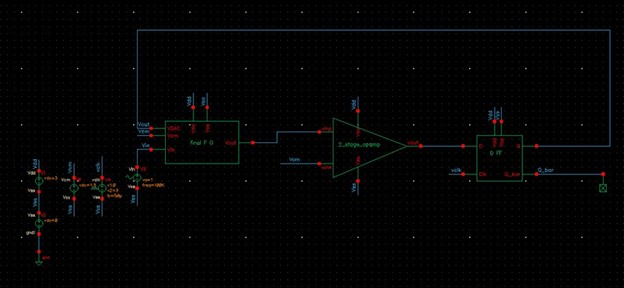
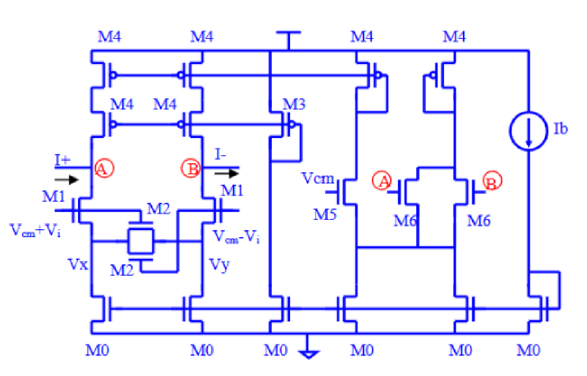
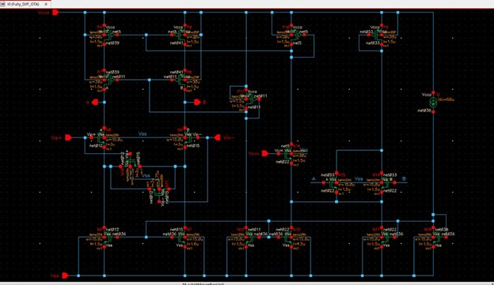
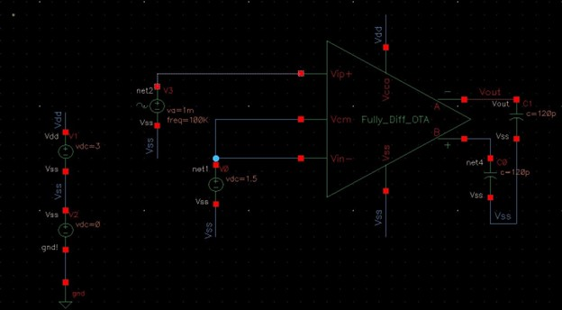
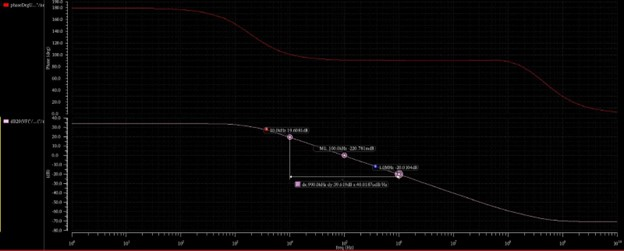
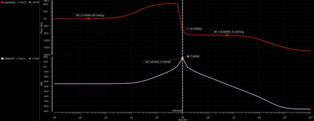
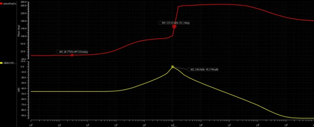
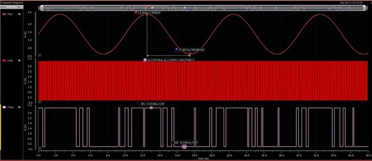

# Bandpass Sigma-Delta Modulator Using Gm-C Filter

## 📌 Project Summary
This project presents the **design, implementation, and verification of a continuous-time bandpass Sigma-Delta (ΣΔ) modulator** using a **Gm-C bandpass filter**.  
The design targets narrowband signals centered around a specific frequency and demonstrates **noise shaping**, **mixed-signal loop stability**, and **transistor-level analog IC design**.

The system integrates:
- A fully differential **Gm-C bandpass filter**
- A high-gain **fully differential OTA**
- A **1-bit quantizer**
- Continuous-time feedback to realize bandpass noise shaping

---

## 🧠 System Architecture
The Sigma-Delta modulator employs a **continuous-time bandpass architecture**, where the signal band is translated away from DC and quantization noise is shaped outside the band of interest.

**Key architectural choices**
- Continuous-time loop for inherent anti-aliasing
- Gm-C implementation for compact area and tunability
- Fully differential signaling for improved noise immunity

---

## 🔧 Gm-C Bandpass Filter Design
The core of the modulator is a **Gm-C bandpass filter** derived using a **low-pass to band-pass (LP→BP) frequency transformation**.  
The filter is implemented using transconductors and capacitors, enabling frequency tuning via bias currents.

**Why Gm-C filters**
- Avoid large on-chip resistors
- Suitable for CMOS integration
- Enable electronic tuning

---

## ⚙️ Fully Differential OTA Design
A **fully differential OTA** is used as the transconductance element within the Gm-C filter.  
The design focuses on achieving sufficient gain and stability while operating inside a continuous-time feedback loop.

**Design features**
- Differential input stage
- Current-mirror biasing
- Common-mode control
- Stable operation with capacitive loads

---

## 🧪 Verification & Testbench
The OTA and filter are verified using dedicated **AC and transient testbenches**, including:
- Differential excitation
- Common-mode biasing
- Capacitive loading representative of loop conditions

---

## 📈 Frequency-Domain Results

### AC Gain & Phase Response
The OTA provides sufficient open-loop gain and phase margin to ensure stable operation within the Sigma-Delta loop.

---

### Bandpass Frequency Response
The Gm-C filter exhibits a clear bandpass characteristic centered at the target frequency, validating the LP→BP transformation.

---

### Noise Shaping (STF & NTF)
The **Signal Transfer Function (STF)** preserves the desired signal band, while the **Noise Transfer Function (NTF)** suppresses quantization noise within the band of interest.

---

## ⏱️ Time-Domain Results
Transient simulations confirm correct Sigma-Delta operation, demonstrating:
- Sinusoidal input excitation
- High-frequency bitstream output
- Proper noise-shaping behavior

---

## 📊 Key Specifications

| Parameter | Value |
|--------|------|
| Architecture | Continuous-time bandpass ΣΔ |
| Center frequency | ~100 kHz |
| Clock frequency | ~8 MHz |
| Supply voltage | 3 V |
| Quantizer | 1-bit |
| Estimated power | ~1.7 mW |
| Estimated area | ~0.63 mm² |

---

## ⚖️ Design Trade-offs
- **Gm-C vs Active-RC:** Gm-C enables tunability and compact area but requires careful bias control.
- **Continuous-time loop:** Improves anti-aliasing but increases sensitivity to excess loop delay.
- **1-bit quantizer:** Ensures high linearity at the cost of higher out-of-band noise.

---

## 🚀 Future Work
- Higher-order Sigma-Delta loop for improved in-band SNR
- Faster dynamic comparator to reduce excess loop delay
- Digital decimation filter integration
- On-chip calibration for PVT variations

---

## 🛠 Tools & Technologies
- Cadence Virtuoso  
- Spectre  
- Analog Design Environment (ADE)  

---

## 👤 Author
**Pankaj Wavre**  
Analog IC Design • CMOS Circuit Design • Mixed-Signal Systems  
🔗 LinkedIn: https://www.linkedin.com/in/pankajwavre/  
🔗 GitHub: https://github.com/pankjawavre
