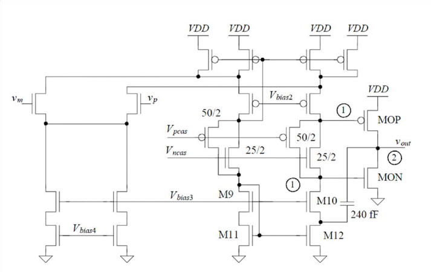
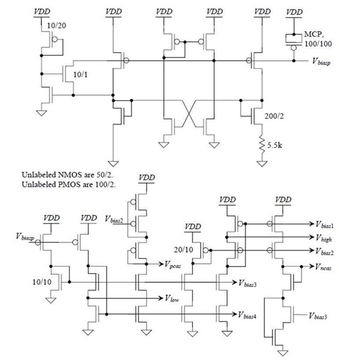
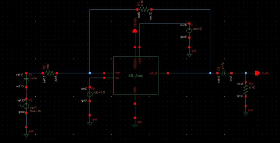
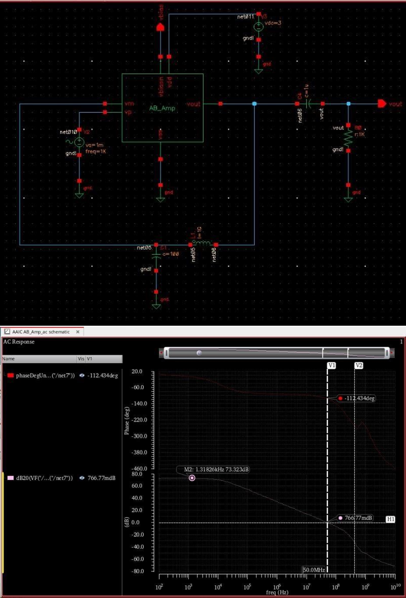
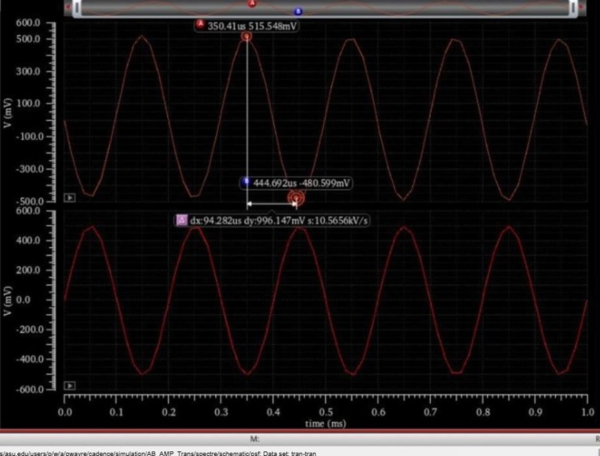
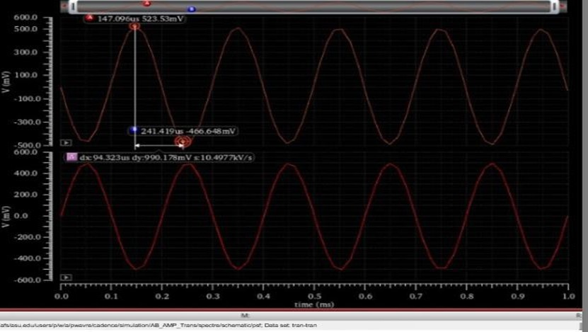
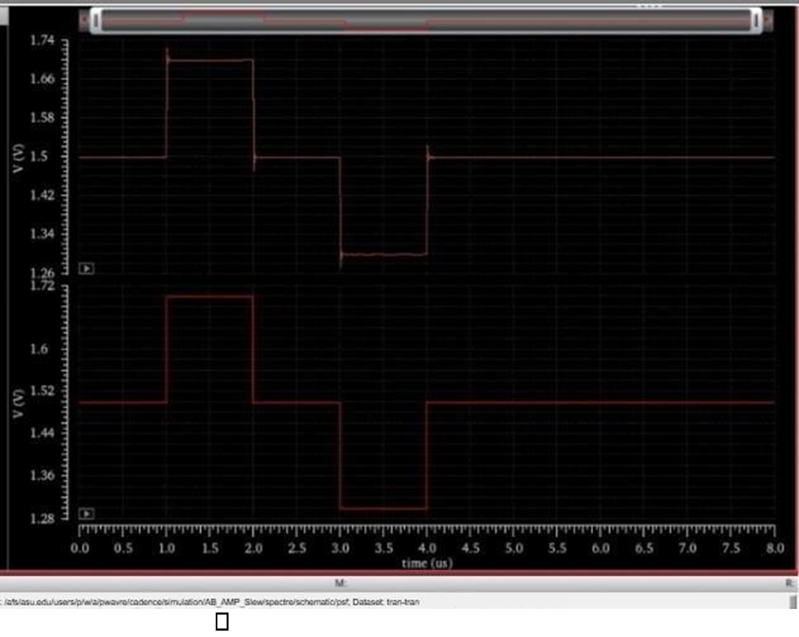
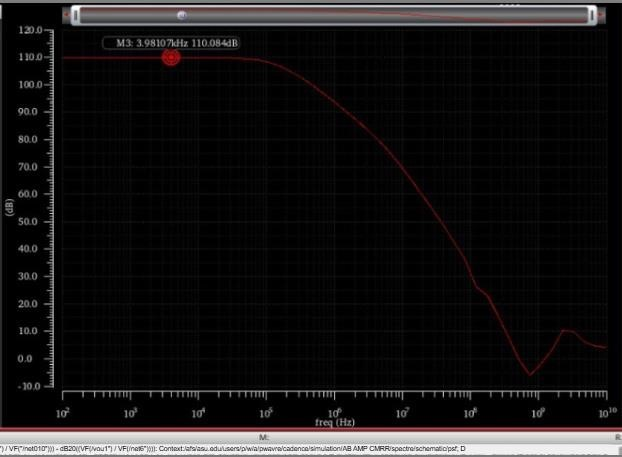
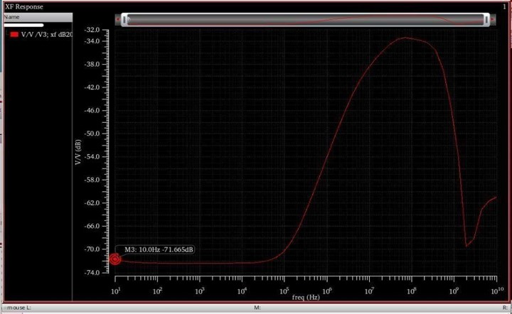

# Folded-Cascode Fully Differential OTA (Class-AB Output)

**Author:** Pankaj Wavre  
**Tagline:** Analog IC Design • CMOS Circuit Design • Mixed-Signal Systems  
**Tools:** Cadence Virtuoso, Spectre, ADE

---

## Project Overview
This project documents the **design and verification** of a **folded-cascode fully differential OTA** with a **Class-AB output stage**, targeted for **high gain, wide bandwidth, and robust mixed-signal performance**.  
Verification includes **AC stability**, **transient behavior across common-mode points**, **slew-rate**, **CMRR**, and **PSRR**.

---

## Contents
- [`figures/`](./figures) – schematics, biasing, and testbench screenshots  
- [`results/`](./results) – simulation plots (AC, transient, CMRR, PSRR, slew, etc.)

---

## Architecture & Design Blocks

### 1) Folded-Cascode Core (Fully Differential)
Key goal: high intrinsic gain using cascode devices while supporting differential signaling.

### 2) Biasing Network
Bias voltages/currents generated to place devices in the intended region of operation.

---

## Testbenches

### AC / Frequency Response Testbench
Used for gain/phase response and stability verification.

---

## Results (Plots)

### AC Gain & Phase Response
- Gain/phase plot used to verify stability and bandwidth behavior.

### Transient Response
- Time-domain behavior under sinusoidal excitation.

### Transient Response (Vcm = 1V)
- Verified operation at a different common-mode point.

### Slew Rate
- Unity-gain follower configuration with **1 pF** load.

### CMRR
- Common-mode rejection across frequency.

### PSRR
- Power-supply rejection across frequency.

---

## Key Takeaways (What this demonstrates)
- **Analog IC design flow:** sizing → biasing → verification in Spectre/ADE  
- **Differential OTA fundamentals:** stability, transient behavior, common-mode sensitivity  
- **Mixed-signal readiness:** CMRR/PSRR and slew-rate characterization

---

## Notes for Recruiters
This repository includes **documentation and measured simulation plots** from Cadence/Spectre runs.  
(Full Cadence design database is not published.)

---

## Connect
- **LinkedIn:** https://www.linkedin.com/in/pankajwavre/  
- **GitHub:** https://github.com/pankjawavre
