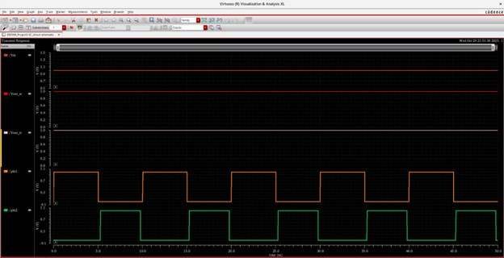
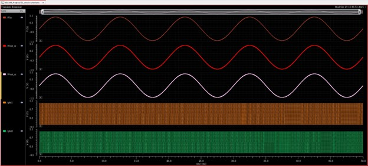

# Switched-Capacitor Integrator (EEE 598 – Project 3)

**Author:** Pankaj Wavre  
**Focus:** Discrete-Time Analog Circuits • Switched-Capacitor Design  
**Tools:** Cadence Virtuoso, Spectre, ADE

---

## 📌 Project Overview
This project demonstrates the **design and verification of a switched-capacitor (SC) integrator**, implemented and simulated in Cadence Virtuoso as part of **EEE 598 (Switch-Capacitor Circuits)**.

Switched-capacitor circuits emulate resistor behavior using clocked capacitors, enabling:
- Precise time-constant control
- CMOS-friendly integration
- Robust discrete-time analog signal processing

This design focuses on **correct clocking, charge transfer, and dynamic integration behavior**.

---

## 🧠 Architecture & Concept
The SC integrator operates using **non-overlapping clock phases (ϕ1, ϕ2)**:
- During ϕ1, the input is sampled onto the capacitor
- During ϕ2, the stored charge is transferred to the integrating node
- Repeated charge transfer results in discrete-time integration

To validate correctness, the SC integrator is implemented within a **comparison testbench**, alongside an RC reference path.

---

## 🔧 SC Integrator & Testbench Schematic
The schematic below shows the **switched-capacitor integrator within a comparison testbench**, highlighting:
- Clocked switches
- Sampling and integrating capacitors
- SC output path versus RC reference

---

## 🧪 Simulation Results

All simulations were performed using **Spectre transient analysis**, verifying both clock operation and integration behavior.

---

### 🔹 DC Input Verification
With a DC input applied, the output settles correctly, confirming:
- Proper charge transfer
- Stable clocking
- No clock overlap issues

---

### 🔹 Transient Response (100 Hz AC Input)
A low-frequency sinusoidal input demonstrates clear **integrator behavior**, with the output showing the expected phase relationship and amplitude scaling.

---

### 🔹 Transient Response (1 kHz AC Input)
At a higher input frequency, the integrator continues to operate correctly, validating **dynamic performance and bandwidth capability**.

---

## 📊 Key Observations
- Non-overlapping clocks ensure correct switched-capacitor operation
- Output waveforms confirm discrete-time integration
- SC behavior closely matches expected theoretical response
- Comparison with RC reference provides validation baseline

---

## 🎯 What This Project Demonstrates
- Practical **switched-capacitor circuit design**
- Understanding of **clocked analog systems**
- Discrete-time signal processing concepts
- Cadence-based verification of SC circuits

This project complements continuous-time designs (Gm-C filters, OTAs) by showcasing **discrete-time analog expertise**.

---

---

## 🔗 Connect
- **LinkedIn:** https://www.linkedin.com/in/pankajwavre/  
- **GitHub:** https://github.com/pankjawavre

